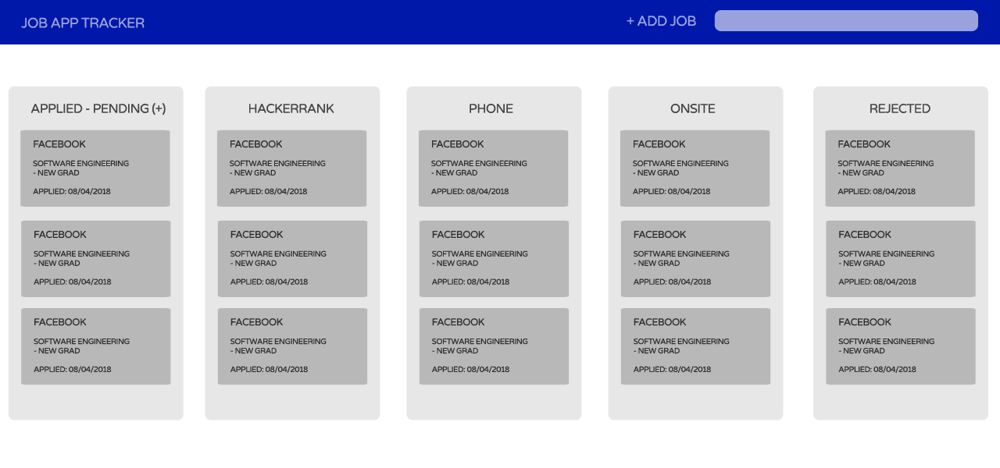
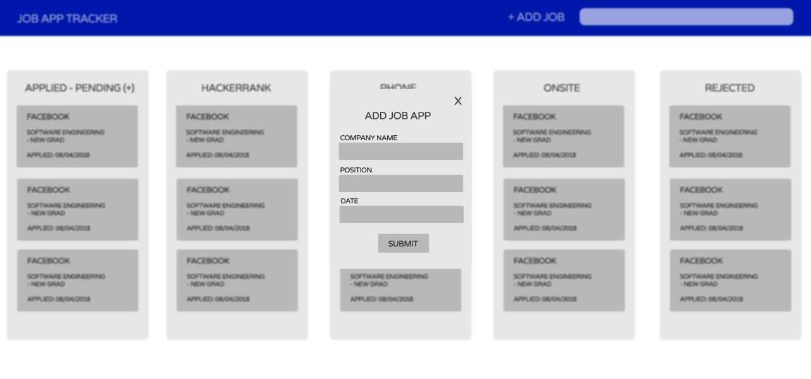
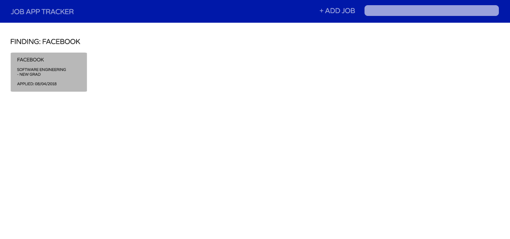
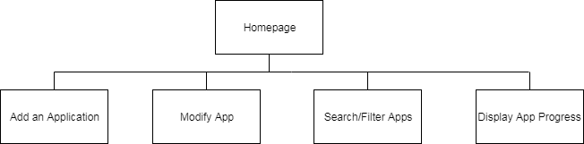

# kanban style job tracker

## about

Applying to jobs has always been a very confusing and messy process, especially when I've been mindlessly dropping resumes and applications like there is no tomorrow. As a result, it gets hard to remember which companies I've already applied and how far I've progressed with my interview process. Currently, I am using a Google sheets to keep track of the company, the position I applied for, the status of my applciation, and how far I've progressed in the interview process: 


This method isn't very visually understandable and checking if a company is already listed is a simple `ctrl+f` away but it's not the most intuitive way to see whether I've already applied or not.

Hence, I'm inspired to create a kanban card style job tracker that will help me intuitively and effectively understand and track my job search progress.

## to use
The application is currently deployed live <a href="http://linserv1.cims.nyu.edu:24513/">here</a>. You can scroll through the kanban boards horizontally with your keyboard arrows!


## requirements

An application that I create when applying for a company will be stored as such:
```javascript
{
  company: {type: String, required: true},
  position: {type: String, required: true},
  status: {type: Boolean, default: true, required: true},
  offerred: {type: Boolean, default: false, required: true},
  applied: {type: String, required: true},
  stage: {type: String, default: 'Applied', required: true}
}, {
  _id: true
}
```

If I get invited to an interview for a job I applied for, an interview object/entry will be populated:
```javascript
{
  job_id: {type: Schema.Types.ObjectId, ref: 'Application'},
  type: {type: String, required: true},
  comments: [{body: String}]
}
```
Interview type can be `HR`, `Technical`, `Onsite`, etc.

The user itself look look as follows:
```javascript
{
  local: {
  	username: {
  		type: String,
  		unique: true
  	},
  	password: String
  },
  lists:  [{ type: mongoose.Schema.Types.ObjectId, ref: 'Application' }]
}
```

## wireframes
Homepage can look as follows:


Adding or editing an entry will look as follows:


You can also filter by company/progress, etc:


## sitemap


## usecase
1. as non-registered user, I can register a new account with the site
2. as a user, I can log in to the site
3. as a user, I can create an application entry
4. as a user, I can view all of the application entries I've made organized by the application's progress
5. as a user, I can update an application card by clicking on the pencil icon next to a company's name
6. as a user, I can view the progress of an application in a graph
